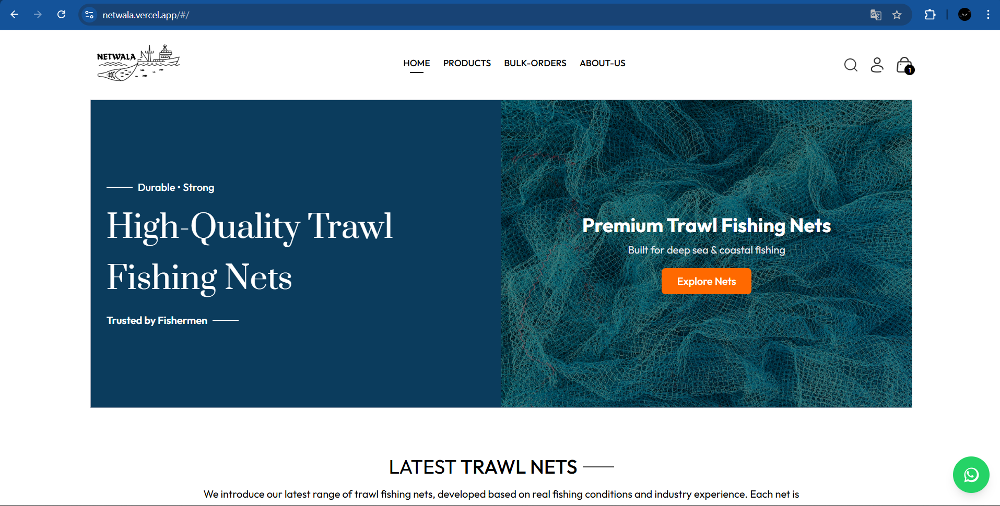
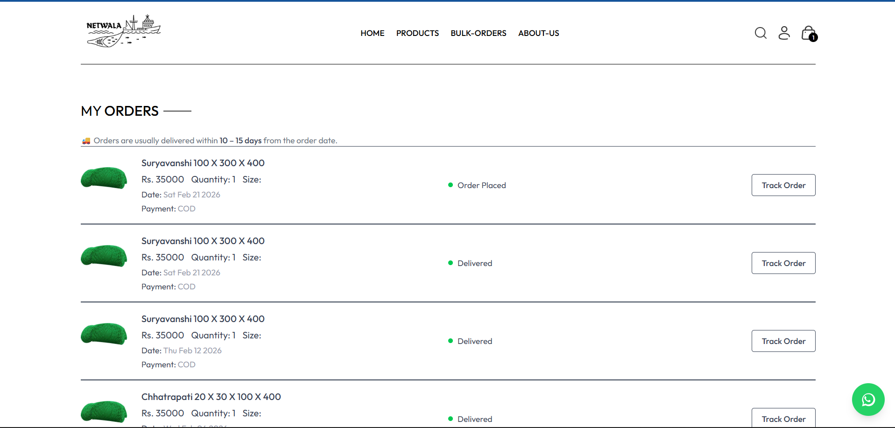
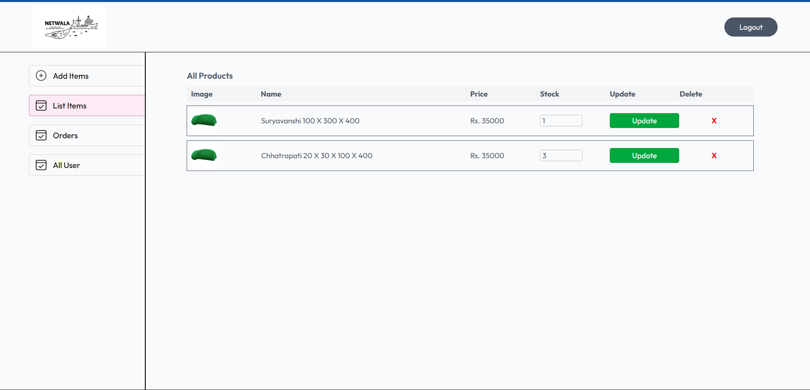
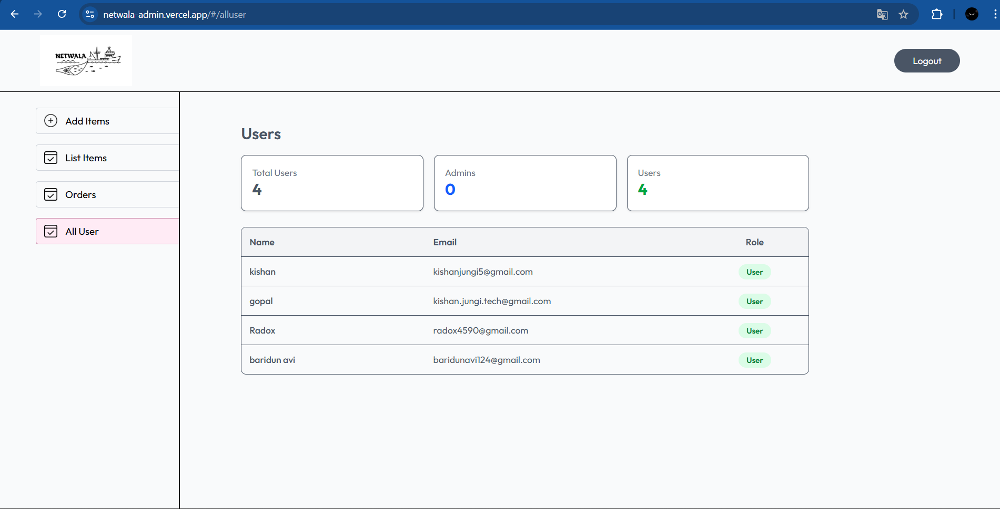

# 🛍️ Netwala – Modern E-Commerce Platform

Netwala is a full-stack e-commerce web application built using the MERN stack.  
It provides a seamless shopping experience with secure authentication, product management, and payment integration.

## 🚀 Live Demo
🔗 https://netwala.vercel.app

---

## ✨ Features

- 🔐 User Authentication (JWT based)
- 🛒 Add to Cart & Remove from Cart
- 📦 Product Listing & Filtering
- 👤 User Profile Management
- 💳 Online Payment Integration
- 📱 Fully Responsive Design
- 🔄 Real-time Database Updates

---

## 🛠️ Tech Stack

**Frontend:**
- React.js
- Tailwind CSS
- Axios
- React Router DOM

**Backend:**
- Node.js
- Express.js
- MongoDB
- JWT Authentication

**Deployment:**
- Vercel (Frontend)
- Render (Backend)

---

## 📸 Screenshots







---

## ⚙️ Installation & Setup

Clone the repository:

```bash
git clone https://github.com/kishanjungi/netwala.git
cd netwala
```

### Install Dependencies

```bash
npm install
```

### Setup Environment Variables

Create a `.env` file in backend folder:

```
MONGO_URI=your_mongodb_connection
JWT_SECRET=your_secret_key
RAZORPAY_KEY=your_key
```

### Run the Project

Frontend:
```bash
npm run dev
```

Backend:
```bash
npm start
```

---

## 📂 Folder Structure

```
netwala/
 ├── frontend/
 ├── backend/
 ├── admin/
```

---

## 🚀 Future Improvements

- Order Tracking System
- Product Reviews & Ratings
- Wishlist Feature
- Stripe Payment Integration

---

## 👨‍💻 Author

**Kishan Jungi**
- GitHub: https://github.com/kishanjungi
- LinkedIn: https://linkedin.com/in/kishanjungi

---

⭐ If you like this project, consider giving it a star!